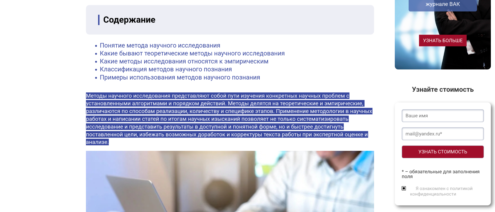

# Translator-In-Terminal

**Translator-In-Terminal** is a terminal-based translation tool.  
It detects the language of the selected text and automatically translates it into **Polish** by default.

## How it works

1. The program reads the currently selected text from the system clipboard.
2. It automatically detects the language of the selected text.
3. It then translates the text into Polish using the MyMemory translation API.

If you want to translate into a language other than Polish, you can do so by editing **line 29 in `main.rs`**.  
Make sure to follow the language code conventions used in the `detect_language.rs` file.

### Notes

- Due to limitations of the free API, translations may occasionally be inaccurate.
- In order for language detection to work properly, you should **select more than just a single sentence** — very short texts might be misclassified.

## Requirements

To build and run this program, you need:

- The **Rust compiler and Cargo**
- The **xclip** tool (for accessing the clipboard)
- The **zenity** tool (for graphical pop-ups)

## API Key

In order to use the translation API, you must provide your own API key.  
Open the file `main.rs` and paste your unique key on **line 12**.

You can obtain a free key from the MyMemory website:  
👉 [https://mymemory.translated.net/doc/keygen.php](https://mymemory.translated.net/doc/keygen.php)

## How to build and use

1. In the project’s root directory, run:
   ```bash
   cargo build --release
   ```

2. The compiled binary will be located at:
   ```
   ./target/release/Built-In-Translator
   ```

3. Assign the binary to a keyboard shortcut of your choice using your system's keyboard shortcut settings.

4. Now, whenever you **select a piece of text** and press your assigned shortcut, the program will automatically translate it.

## Example

Below is an example of how the program works, with two screenshots:

  

